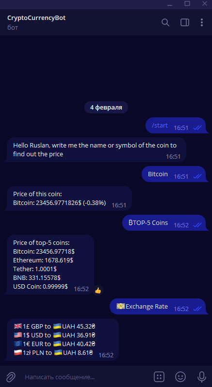

# Project CryptoBOT

A Cryptobot is a telegram bot that searches for a coin or token by its name or symbol. 
The user enters a coin name or coin symbol and receives in response the price of that coin in dollars, as well as its rise or fall over the last twenty-four hours. The user can also use the "TOP-5 Coins" button and get the prices of the top five coins. 
The button "Exchange Rate" shows the exchange rate of hryvnia in dollars, euros, pounds and zloty



### Try bot: https://t.me/CryptoExchange_Rate_Bot

<br/>

## Additional documentation

[How to create telegram bot](https://www.freecodecamp.org/news/how-to-create-a-telegram-bot-using-python)

[Coinmarketcap API Documentation](https://coinmarketcap.com/api/documentation/v1/#section/Quick-Start-Guide)


## Building a repository and running it locally
 
Run in the console:

    git clone https://github.com/Rout357/CryptoBot.git
    pip install -r requirments.txt

## Settings

1. Сreate a file `Settings.py`
2. Write in the Settings.py

```
token = "API key of your bot from BOTFuther" 
coin_api = "Coinmarketcap api key"
```

## Run Bot

    python3 main.py

